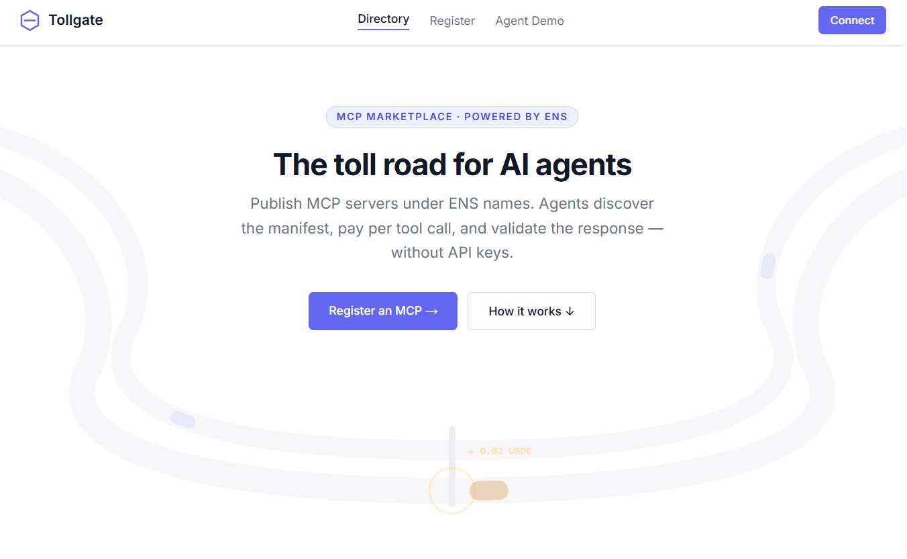
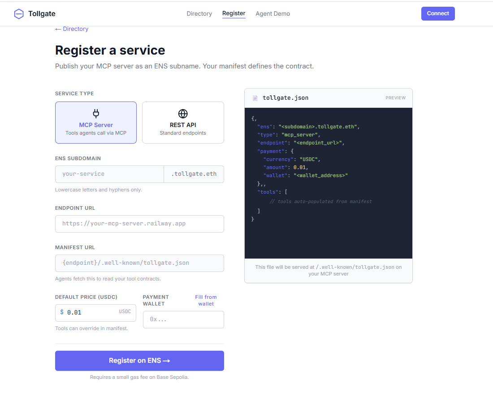
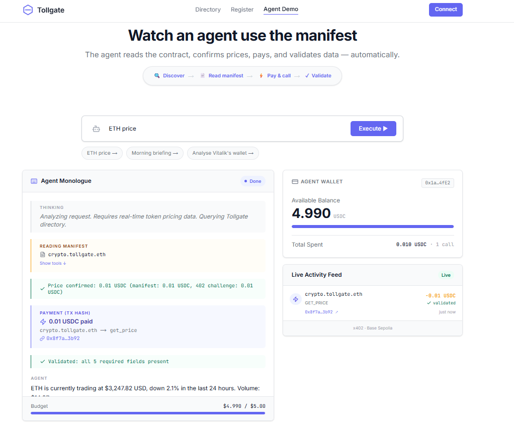

# Tollgate


**Tollgate is an ENS-native, pay-per-call marketplace for MCP servers.** It acts as the infrastructure layer connecting AI agents to the data and capabilities they need — without API keys, subscriptions, or human intervention.


## Screenshots

**Directory / Home**



**Service Registration**



**Agent Demo & Live Activity**



---

## The Problem

Current AI agents require pre-loaded API keys. This creates three problems:
1. **No Discovery**: Developers must manually find, sign up for, and provide credentials to the agent.
2. **No Trust**: If an API's return format changes, the agent breaks silently because it cannot verify response schemas.
3. **No Autonomous Payment**: Humans must pre-fund API accounts and manage subscriptions.

## The Tollgate Solution

Tollgate solves this with three primitives:
1. **ENS for Discovery**: Agents resolve an ENS subname (e.g., `weather.tollgate.eth`) to find the server URL.
2. **Tollgate Manifest for Trust**: A machine-readable JSON contract (`/.well-known/tollgate.json`) declares tool schemas and prices.
3. **KeeperHub for Payment**: Agents autonomously pay per-tool call using the x402 protocol and KeeperHub's agentic wallet.

---

## Core Architecture

Tollgate is built on four layers. Every interaction flows through all four:

### 1. ENS Registry Layer (Discovery)
Instead of a centralized database, Tollgate uses **ENS on Base Sepolia**. Every registered MCP is an ENS subname under `tollgate.eth`.
The registry uses the `tollgate:` text record namespace:
- `tollgate:url` - The base URL of the MCP server.
- `tollgate:manifest` - A verifiable pointer to the server's manifest (the trust anchor).
- `tollgate:payee` - The wallet address receiving USDC payments.

### 2. Tollgate Manifest (Trust)
Every registered MCP server hosts a `tollgate.json` file. Before calling any tool, an agent fetches this manifest to:
- Discover available tools and parameter requirements (`inputSchema`).
- Confirm prices per tool (preventing surprise overcharges).
- Validate the response structure (`outputSchema`). 

### 3. Payment Layer — KeeperHub x402 (Execution)
Built around KeeperHub's agentic wallet and the x402 protocol:
- The agent calls a tool. The MCP returns an HTTP 402 Payment Required challenge.
- The KeeperHub agentic wallet intercepts the challenge, signs a USDC transfer on Base Sepolia, and retries the request with a payment header.
- The MCP verifies the payment and returns the requested data.

### 4. Compute Layer — 0G Compute Network (Inference)
Tollgate leverages the 0G Compute Network to handle the agent's core reasoning and inference capabilities:
- Provides high-performance, decentralized access to LLMs (like `zai-org/GLM-5-FP8`) via an OpenAI-compatible router.
- Processes user prompts, plans tool executions, and parses the structured JSON returned by MCPs to synthesize the final answer.

---

## The Demo Agent

The Tollgate repository includes an autonomous demo agent (powered by 0G Compute Network) that demonstrates the flow end-to-end:
1. Lists available services from ENS.
2. Fetches the Tollgate manifest for the selected services.
3. Verifies the tool price.
4. Calls the tool and autonomously pays via KeeperHub.
5. Validates the returned data against the manifest schema.
6. Synthesizes the final answer.

### Included Demo MCPs:
- **CryptoData** (`crypto.tollgate.eth`): Real-time token prices and market data.
- **Weather** (`weather.tollgate.eth`): Global weather forecasting.
- **OnChain** (`chain.tollgate.eth`): Wallet balances and recent transactions on Base Sepolia.

---

## Tech Stack

- **Frontend**: Next.js 14 App Router, Tailwind CSS, Viem, ENSjs v4
- **Smart Contracts / Chain**: Base Sepolia, USDC
- **Agent Infrastructure**: KeeperHub (Agentic Wallet, x402 protocol), 0G Compute Network (`zai-org/GLM-5-FP8`)
- **Backend / MCP**: Node.js, Express, `@modelcontextprotocol/sdk`

---

## Deployment & L2 Registrar (Durin on Base Sepolia)

Tollgate uses a Durin-based L2 Registrar deployed on **Base Sepolia** to manage ENS subnames for published MCP services. Important operational notes for maintainers and contributors:

- **L2 Registrar / Registry**: The on-chain registry lives on Base Sepolia. The repository references the registry/registrar addresses via environment variables (for example `DURIN_L2_REGISTRY` / `DURIN_L2_REGISTRAR`) and lookup code reads them from `process.env`.
- **ENS parent name**: Configure the ENS parent name via `NEXT_PUBLIC_PARENT_ENS` (development default: `tollgate.eth`). The agent and API endpoints compute the parent node via `namehash(parent)` and derive subname nodes by hashing the sublabel + parent node.
- **Text record namespace**: Registered subnames publish `tollgate:` text records that agents read directly from the L2 Registry contract:
	- `tollgate:url` — MCP base URL
	- `tollgate:manifest` — `.well-known/tollgate.json` manifest URL (trust anchor)
	- `tollgate:payee` — USDC payee address
	- `tollgate:description`, `tollgate:category`, `tollgate:type`
- **USDC & Chain**: Payments use Base Sepolia USDC. Ensure RPC endpoints, private keys, and USDC addresses are configured in environment files before running payments or deploy scripts.

Deployment scripts and related artifacts:
- `packages/hardhat/deploy/01_deploy_l2_registrar.ts` — deployment script for the L2 Registrar.
- `packages/nextjs/app/api/ens/list/route.ts` — server route that enumerates registered services from on-chain logs and reads `tollgate:*` text records.

## Commit & Push Strategy (sequential, low-risk)

To keep changes small and reviewable, push sequentially rather than in a single large upload. Recommended sequence:

1) Commit documentation changes first (README, docs).

```bash
git add README.md
git commit -m "docs: add L2 Registrar (Base Sepolia) notes and push plan"
git push origin HEAD:mcp
```

2) Commit infrastructure/runtime fixes next (API routes, payment-store, env changes).

```bash
git add packages/nextjs/app/api/agent/* packages/nextjs/.env.local
git commit -m "agent: persist payment pending map; log payment route; add ZEROG_BASE_URL to .env.local"
git push origin HEAD:mcp
```

3) Commit package-specific changes one package at a time (e.g., `packages/agent`, `packages/mcp-*`), pushing after each commit so CI and reviewers can inspect small diffs.

Notes and tips:
- Use focused commit messages describing the intent of each change.
- If you need a PR, push the `mcp` branch and open a draft PR comparing `mcp` → `main`.
- Restart the Next dev server after changing `.env` files so server-run code picks up new values.

If you want me to perform these commits and pushes now, confirm and I'll proceed in that order.